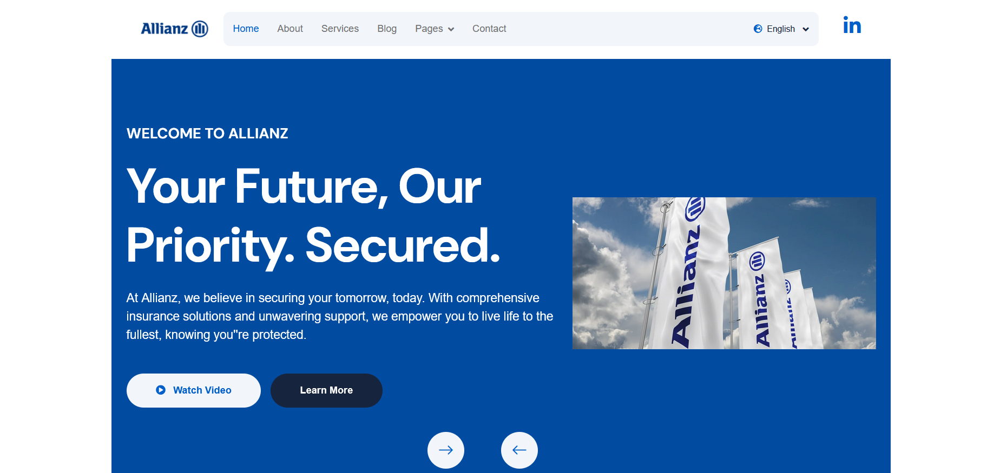
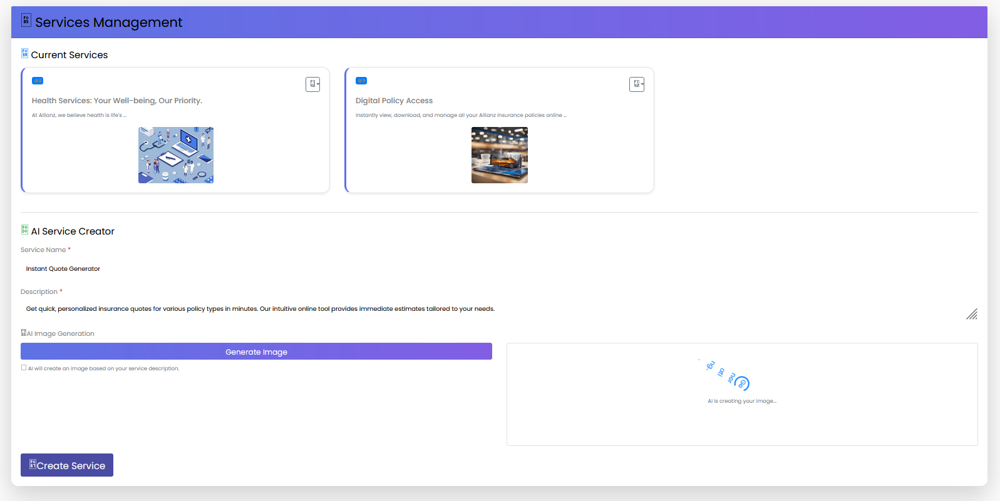
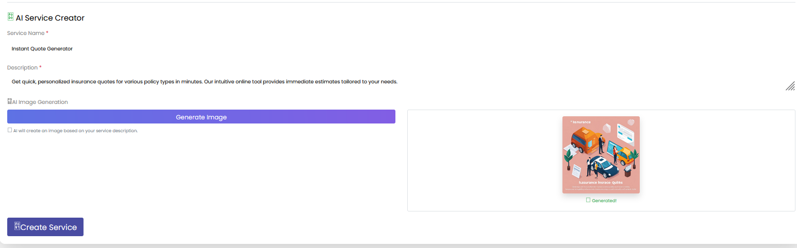
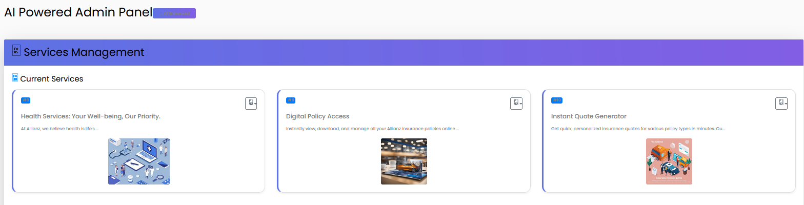
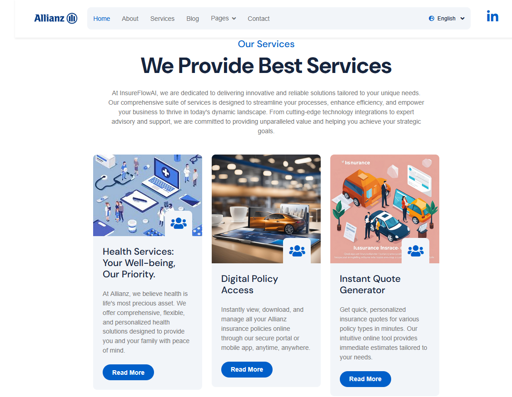
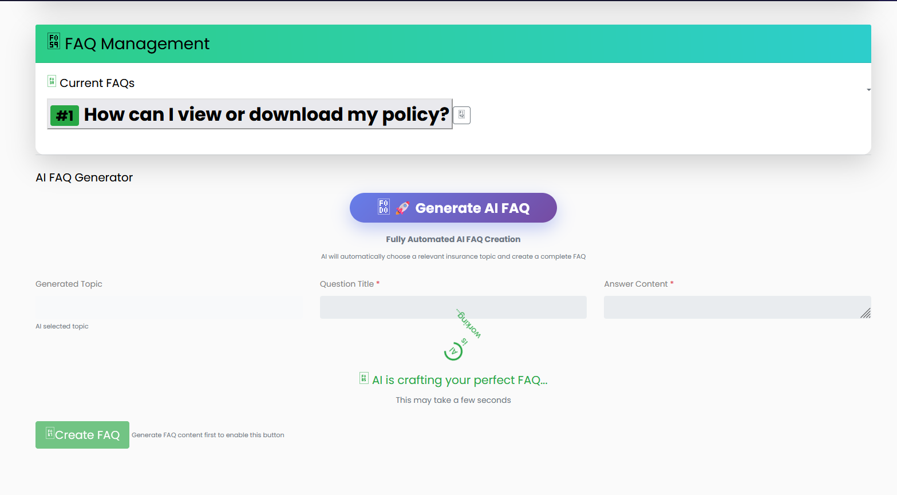
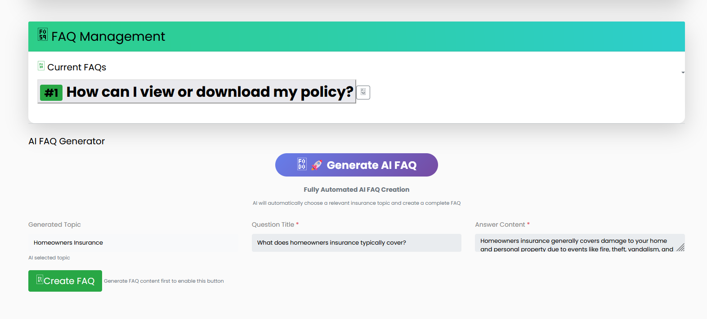

# InsureFlowAI 🏢🤖

**InsureFlowAI**, modern sigorta şirketleri için geliştirilmiş yapay zeka destekli web platformudur. Platform, N-Layer Architecture prensiplerine dayalı olarak geliştirilmiş ve yapay zeka entegrasyonları ile sigorta sektöründe dijital dönüşümü desteklemektedir.

## 🚀 Özellikler

### 🤖 Yapay Zeka Entegrasyonları
- **Otomatik FAQ Üretimi**: ChatGPT-42 API ile sigorta konularında profesyonel soru-cevap üretimi
- **İçerik İyileştirme**: Mevcut FAQ sorularını ve cevaplarını AI ile geliştirme
- **Görsel Üretim**: Stable Diffusion ile sigorta hizmetleri için profesyonel görsel oluşturma
- **Random FAQ Generator**: Çeşitli sigorta konularında rastgele FAQ üretimi

### 📊 Admin Paneli
- **FAQ Yönetimi**: CRUD işlemleri ile FAQ ekleme, düzenleme ve silme
- **Servis Yönetimi**: Sigorta hizmetlerini yönetme ve AI ile görsel oluşturma
- **AI Araçları**: Entegre yapay zeka araçları ile içerik üretimi
- **Dinamik İçerik**: Real-time içerik güncellemeleri

### 🌐 Kullanıcı Arayüzü
- **Responsive Design**: Bootstrap 5 ile mobil uyumlu tasarım
- **Çoklu Dil Desteği**: Türkçe/İngilizce dil seçenekleri
- **LinkedIn Entegrasyonu**: Şirket bilgilerini LinkedIn'den çekme
- **Modern UI Components**: Carousel, Counter, Lightbox gibi modern bileşenler

## 🏗️ Teknoloji Stack

### Backend
- **Framework**: ASP.NET MVC 5
- **Language**: C# (.NET Framework)
- **Architecture**: N-Layer Architecture (3-Tier)
- **Database Approach**: Database First (Entity Framework 6)
- **Dependency Injection**: Unity Container

### Frontend
- **UI Framework**: Bootstrap 5
- **JavaScript Libraries**: 
  - jQuery 3.7.0
  - Owl Carousel
  - WOW.js (Animations)
  - Lightbox
  - CounterUp
- **Template**: LifeSure Insurance Template

### Database
- **DBMS**: Microsoft SQL Server
- **ORM**: Entity Framework 6 (Database First)
- **Connection**: Entity Framework DbContext

### AI Services
- **Text Generation**: ChatGPT-42 API (RapidAPI)
- **Image Generation**: Stable Diffusion 1.5 XL (RapidAPI)
- **Social Media**: LinkedIn Company API

## 🏢 Proje Mimarisi

### N-Layer Architecture Yapısı

### Katman Sorumlulukları

**🎯 Presentation Layer (Web)**
- MVC Controllers ile HTTP isteklerini yönetme
- Razor Views ile kullanıcı arayüzü
- ViewModels ile veri aktarımı
- Dependency Injection konfigürasyonu

**💼 Business Logic Layer (BLL)**
- İş kurallarının uygulanması
- AI servislerinin yönetimi (FAQ, Image Generation)
- Veri doğrulama ve işleme
- Servis soyutlamaları

**🗄️ Data Access Layer (DAL)**
- Entity Framework 6 ile veritabanı erişimi
- Generic Repository Pattern
- Database First yaklaşımı
- CRUD operasyonları

## 🤖 AI Modelleri ve Servisleri

### 1. ChatGPT-4 API
- FAQ üretimi için
### 2. Stable Diffusion XL
- Görsel üretimi için

## 📸 Uygulama Görselleri

### 🏡 Uygulama Genel Görünümü & Sosyal Etkileşim

| Uygulama Ana Görünümü | Sosyal Medya Pop-up'ı |
|:------------------------:|:--------------------------:|
|  |  |

### ✨ Yapay Zeka Destekli Görsel Oluşturma

| Yapay Zeka Görsel Çizdirtme | Oluşturulmuş Resim |
|:-------------------------------:|:---------------------:|
|  |  |

### ➕ Hizmet Yönetimi

| Servisin Eklenmesi | Ana Sayfa Servisler Görünümü |
|:--------------------:|:---------------------------------:|
|  |  |

### 🤖 Yapay Zeka Destekli SSS Oluşturma

| Yapay Zekaya SSS Oluştururken | Oluşturulmuş SSS Hali |
|:------------------------------------:|:-----------------------------:|
|  |  |

